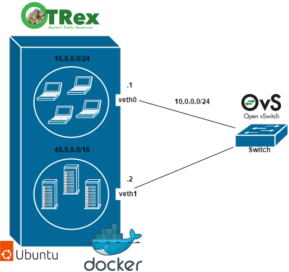

# TRex 
En este repositorio se pueden ver varios escenarios en los que se utiliza el generador de tráfico TRex de CISCO.

## TRexOVS
En esta carpeta se puede encontrar un escenario el cual despliega un contenedor TRex v3.02 conectado a un switch OVS.

## TRexMininet
En esta carpeta se encuentran varios escenarios en los que se despliega TRex a distintas topologias mininet SDN con ONOS como controlador. 
En ella se verá el despliegue del servicio de Trex en un host generado desde mininet, así como su despliegue en un contenedor unico con varios interfaces o el despliegue de varios contenedores Trex. 

## TRexUbuntu
En esta carpeta se podrá encontrar un escenario en el que se desplega TRex conectado a un contenedor con Ubuntu 20.04. 
Este escenario se ha generado para comprobar el correcto funcionamiento de TRex a través de varias subredes. 
