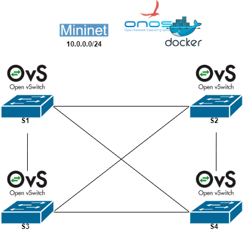
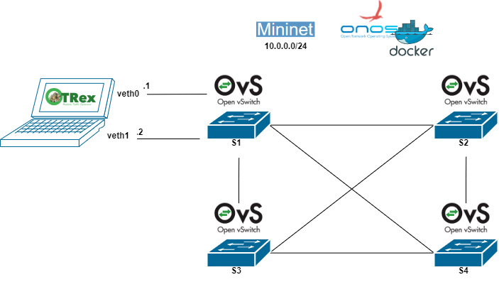
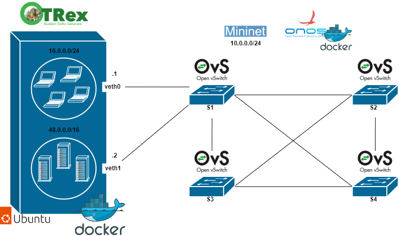
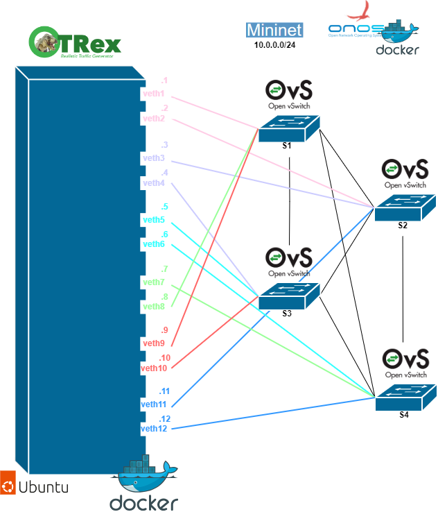

# TRex en Mininet
En esta carpeta se encuentran varios ejemplos de como se puede emplear el generador de tráfico TRex unido a una topología generada con Mininet empleando ONOS como controlador. 
La red desplegada con Mininet es la misma para todos los casos, lo que varia es la configuración del TRex y sus conexiones. Esta red básica Mininet es la siguiente.

  

En el primer escenario se puede ver el generador de tráfico TRex dentro de un host de la topología, en el resto de escenarios el servicio de TRex se encuentra dentro de un contenedor montado con un Dockerfile sobre la imagen de Ubuntu 20.04. 

## InHost
En este escenario el generador de tráfico TRex se encuetra dentro de un host de mininet, este host está unido con dos interfaces al mismo switch de la topología. 
El escenario es el siguiente.

  

## Basic
Aquí se puede encontrar un escenario en el que el los dos interfaces del contenedor TRex se han conectado a un switch de la topología Mininet. 
El escenario es el siguiente.

  

## Complex
En este escenario el contenedor TRex se ha conectado a todos los switches dos a dos para hacer pruebas de todo el tráfico.
Siendo el escenario.

  

## VariousTRex 
En este escenario se pueden seis contenedores TRex, uno para cada una de las conexiones entre switches. 
El escenario es el siguiente. 

  

