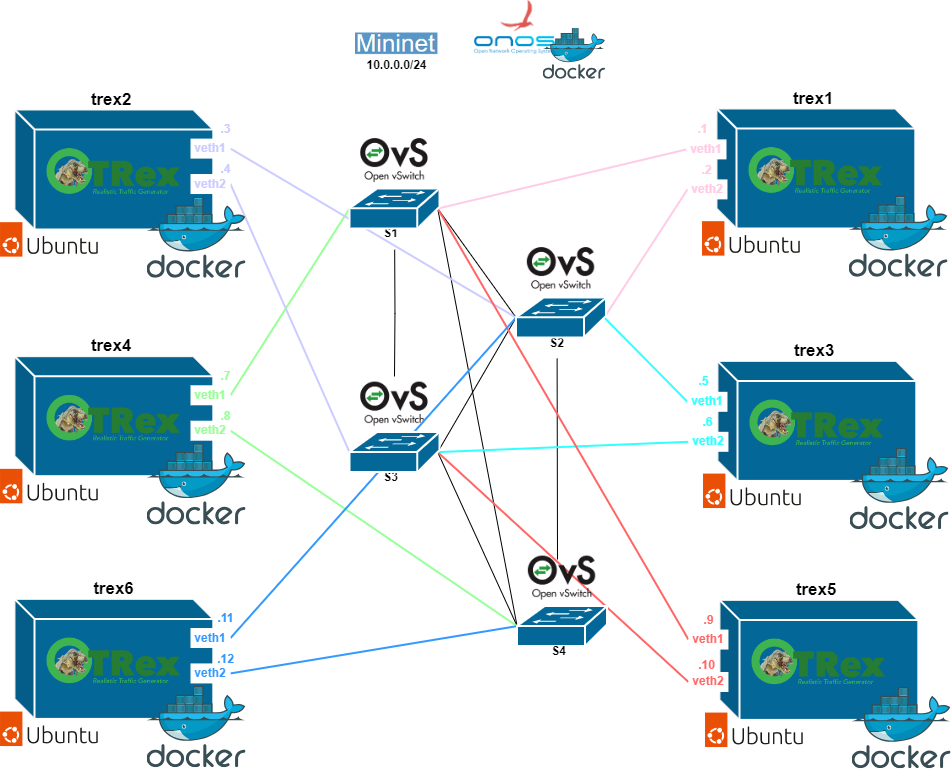

# TRex con Mininet y ONOS (Various TRex)
Este escenario está compuesta por una topología mininet de 4 switches y seis contenedores con el generador de tráfico TRex. Estos contenedores tienen dos interfaces los cuales están conectados a los switches de la topología. 
El escenario es el siguiente.

  

Este escenario se puede desplegar de 2 modos:
- **variosDockerfile:** En este directorio se encuentra un archivo docker-compose el cual despliega los seis generadores de tráfico. Todos los contenedores tienen los mismo modulos, ya que son necesarios para el correcto funcioamiento del generador de tráfico. La diferencia entere ellos es que la imagen Docker que se emplea para el despliegue viene de distintos Dockerfiles. Estos se pueden encontrar en la carpeta llamada "configuration". En cada una de las carpetas de configuración de cada uno de los contenedores TRex se encuentra el fichero "trex_cfg.yaml" el cual es necesario para la configuración de los interfaces del TRex. 

- **unDockerfile:** Si se despliegua empleando las instrucciones de este directorio el resultado será el mismo, pero solo construyendo una imagen de Trex en vez de una distinta por cada contenedor. Como se entiende de la explicación anterior, el fichero "trex_cfg.yaml" tiene que ser distinto en cada uno de los contenedores. El archivo docker-compose encontrado dentro de este directorio es igual que el encontrado en la explicada anteriormente salvo que a cada uno de los contenedores se le ha enviado como variables de entorno las direcciones IPs correspondientes para poder incluirlas en el fichero de configuración del generador. Como en el Dockerfile que genera la imagen de los contenedores no se ha pasado el fichero "trex-cfg.yaml" este se tiene que generar al inicializar el contendor con el fichero Python "cfgcreator.py". La ejecución de este fichero escribe el fichero de configuración de interfaces rellenando los campos que requieren de las direciones IPs.