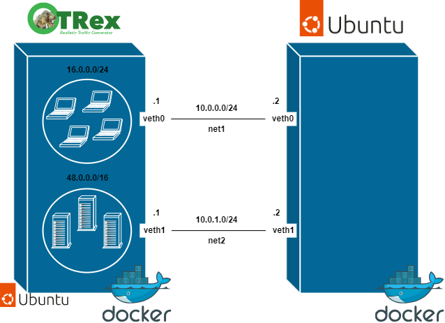

# TRex con Ubuntu 20.04
Este escenario se ha desplegado para probar la generación de paquetes con TRex con 2 subredes distintas para comprobar el correcto funcionamiento de ARP con el generador de trafico TRex de CISCO. 
El escenario que se va a desplegar es el siguiente.

  

## Configuracion TRex

Se construye la imagen de TRex 2.97 sobre un Ubuntu 20.04. (Este paso no es neecesario realizarlo siempre)
~~~
docker build -t trexubuntu:20.04 .
~~~

Se monta el contenedor con la imagen generada
~~~
docker run --privileged --cap-add=ALL -v /mnt/huge:/mnt/huge -v /lib/modules:/lib/modules:ro -v /sys/bus/pci/devices:/sys/bus/pci/devices -v /sys/devices/system/node:/sys/devices/system/node -v /dev:/dev -it --name trexubuntu trexubuntu:20.04
~~~

## Configuracion Ubuntu 20.04
Para desplegar un contenedor con una imagen de ubuntu 20.04.
~~~
docker run --rm -it --privileged --name ubuntu --cap-add=ALL ubuntu:20.04
~~~

## Conexiones
Conexiones entre ubuntu y TRex
~~~
./conf.sh
~~~

Si se quieren utilizar herramientas basicas hay que instalarlas:
~~~
apt update
apt install net-tools iputils-ping tcpdump iproute2
~~~
Así ya se podrá hacer ifconfig y ping para comprobar los insterfaces creados.  

## Rutas estaticas
En el Ubuntu:
Añadir la ruta de los servidores
~~~
ip route add 48.0.0.0/16 via 10.0.1.1
~~~
Añadir la ruta de los clientes
~~~
ip route add 16.0.0.0/24 via 10.0.0.1
~~~

## Prueba HTTP básica
Para acceder al contenedor 
~~~
docker exec -it trexubuntu bash
~~~

Se habilita el servicio del TRex para esto hay que ejecutar el siguiente comando dentro del contenedor TRex
~~~
./t-rex-64 -i --astf
~~~
Para esto tiene que estar actualizado python3 y python3-distutils.

Para acceder a la consola de TRex, en otro terminal realizar el siguiente comando dentro del contenedor
~~~
./trex-console
~~~

El siguiente comando realizado en la consola del TRex lanza una pueba basica astf de trafico http.
~~~
start -f astf/http_simple.py 
~~~
https://trex-tgn.cisco.com/trex/doc/trex_astf.html

## Comprobación
Si se quiere comprobar el correcto funcionamiento se puede realizar un tcpdump en cualquiera de los interfaces del TRex.
~~~
sudo tcpdump -i veth0 -w capture.pcap &
~~~
Este comando tambien guarda dicha captura de tráfico en un fichero.

El siguiente comando permite observar el tráfico.
~~~
tcpdump -r capture.pcap
~~~

Si se quiere observar el tráfico con Wireshark se puede mandar copiar el fichero en local y desde ahí abrirlo con Wireshark.
~~~
docker cp trexubuntu:/var/trex/v2.97/capture.pcap .
wireshark capture.pcap
~~~
